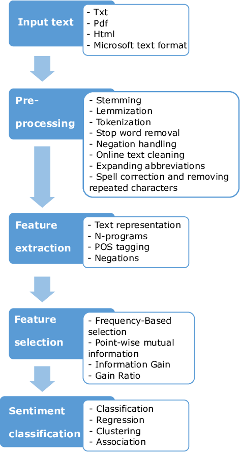

# Sentiment-Analysis

Sentiment Analysis is a field of Natural Language Processing responsible for systems that can extract opinions from natural language. NLP targets creating pipelines that can understand language like we humans do. Sentiment analysis is one of the most basic problems in NLP and is usually one of the first problem that students face in a Natural Language Processing course.

**Why Sentiment Analysis?**

From being able to mine opinions from product reviews to being able to forecast stock prices by studying tweets, sentiment analysis has a very wide range of applications. Sentiment Analysis forms the basis for almost every other pipeline in what we call Natural Language Understanding, due to the intuitive nature of the problem.

From an instructor’s point of view, sentiment analysis contains everything that a Data Scientist working in NLP should be aware of. Sentence processing and all the common models/architectures used in NLP can be covered under the umbrella of Sentiment Analysis.

**Types of Sentiment Analysis**

Sentiment Analysis is essentially a classification problem. While sentiment analysis contains a wide array of problem variety, the most common types can be broadly divided as,

***Polarity Detection :*** Talking about the polarity of the sentence, that is, positive, negative or neutral. Sometimes the classification can be even more fine tuned, like very positive, positive, neutral, negative and very negative.

***Emotion Detection :*** Detecting the emotion of the speaker from the sentence, for example, happy, sad, angry etc.

***Intent Detection :*** Being able to detect not only what is present in the sentence but also its intent.

## Pipeline

